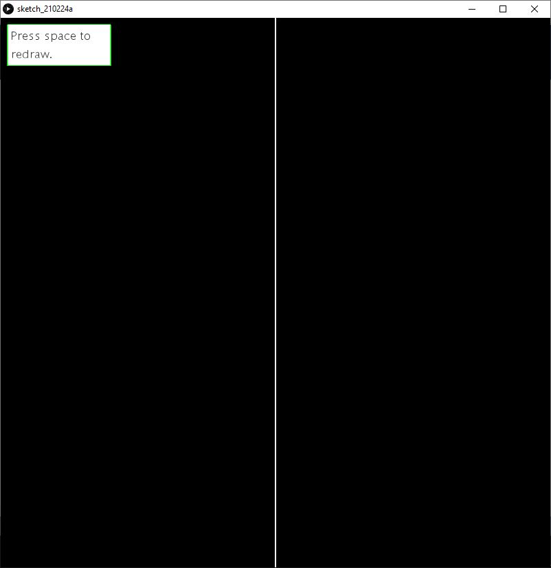
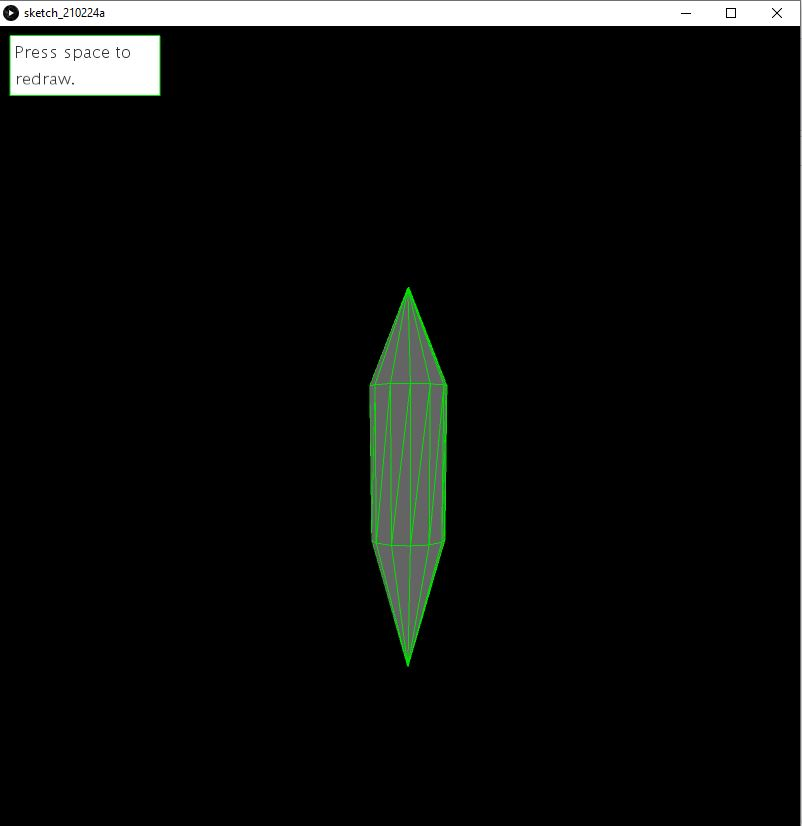
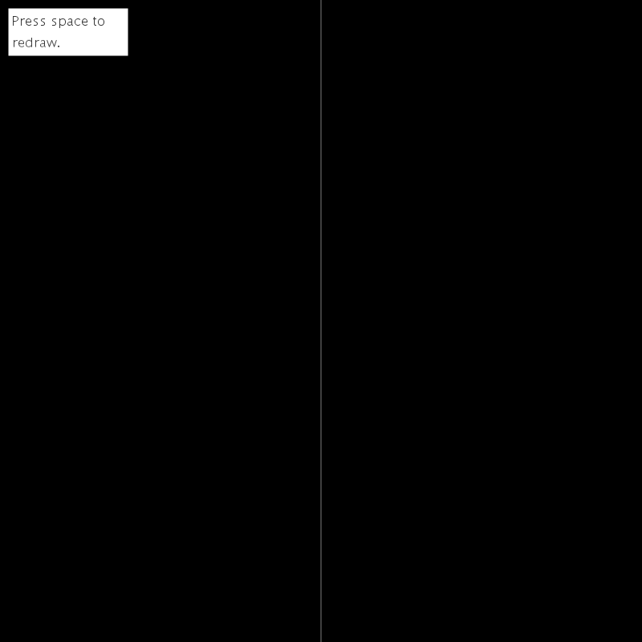

# Figure_2D_To_3D_Using_Solid_of_Revolution
Script que convierte una figura 2D en 3D proyectando los vértices por el eje z desarrollado en el entorno Processing3.
<!-- PROJECT LOGO -->
 

  <h3 align="center">Script que convierte una figura 2D en 3D</h3>

  

    ¡Usa un solido de revolución para crear una figura 3D!
     
      <a href="https://github.com/carlosepb/Figure2DTo3DUsingSolidOfRevolution"><strong>Explorar repositorio»</strong></a>
     
     
      <a href="https://github.com/carlosepb/Figure2DTo3DUsingSolidOfRevolution/blob/main/images/animation.gif">Ver Demo</a>
      ·
      <a href="https://github.com/carlosepb/Figure2DTo3DUsingSolidOfRevolution/issues">Reportar Error</a>
      ·
      <a href="https://github.com/carlosepb/Figure2DTo3DUsingSolidOfRevolution/issues">Solicitar Colaboración</a>
    

  

<!-- TABLE OF CONTENTS -->

  
Tabla de Contenido

  <ol>
    <li>
      <a href="#sobre-el-proyecto">Sobre el Proyecto</a>
      <ul>
        <li><a href="#herramientas-de-desarrollo">Herramientas de Desarrollo</a></li>
      </ul>
    </li>
    <li><a href="#trabajo-realizado">Trabajo Realizado</a></li>
    <li>
      <a href="#empezando">Empezando</a>
      <ul>
        <li><a href="#prerrequisitos">Prerrequisitos</a></li>
        <li><a href="#instalación">Instalación</a></li>
        <li><a href="#ejecutar">Ejecutar</a></li>
      </ul>
    </li>
    <li><a href="#hoja-de-ruta">Hoja de Ruta</a></li>
    <li><a href="#licencia">Licencia</a></li>
    <li><a href="#contacto">Contacto</a></li>
    <li><a href="#agradecimientos">Agradecimientos</a></li>
  </ol>

<!-- ABOUT THE PROJECT -->
## Sobre el Proyecto

Pequeña aplicación para convertir una figura en 2D en 3D proyectando sus vértices a través del eje z consiguiendo así darle profundidad generando una figura simétrica.
Para esto al ejecutar tendremos una primera pantalla dividida por una línea blanca en dos mitades en la que podremos dibujar la figura que queremos proyectar en el lado izquierdo terminando el modo edición al crear un vértice en el lado izquierdo, pudiendo borrar la figura dibujada en cualquier momento pulsando la tecla espacio(imagen_1.0).

 imagen_1.0(Pause)

Una vez hacemos clic en la parte izquierda de la primera pantalla del programa se generará la figura en 3D, pudiendo borrarla y volver a la zona de dibujo pulsando la tecla espacio(imagen_2.0).

 imagen_2.0(Jugando)

Como podemos ver en el gif inferior podemos dibujar haciendo clic en distintos puntos de la zona de dibujo y dejando que esta se una automáticamente. También podemos ver unas cuantas figuras generadas y como con solo pulsar espacio borramos la figura actual y podemos proceder a dibujar otra sin ningún problema(imagen_3.0).

 imagen_3.0(Saque)

## Trabajo Realizado

En cada una de las pantallas tendremos un mensaje en la parte superior izquierda en la que podemos ver el comando de borrado que consiste únicamente en pulsar la tecla espacio.

Para dibujar las líneas que unen los vértices de la pantalla de dibujo se utilizan la variables mousePressed, mouseX y mouseY para saber cuando se interactúa usando el ratón y las coordenada en las que se ha hecho clic, además de si se encuentra en la de finalizar dibujo.

Se ha creado una pequeña clase con solo dos variables y un constructor para guardar las coordenadas de cada vértice y almacenarlas en un arraylist para el momento de dibujar la figura y rotar los vértices hacerlo con mayor facilidad independientemente del número de estos que haya.

Se utiliza la función translate para mover la figura ya generada por la interfaz a modo de poder visualizarla desde distintos puntos, esta seguirá el puntero del ratón.

Para rotar los vértices se ha creado una función a la que se le pasan el vértice actual y el inmediatamente inferior además del ángulo el cual definirá el número de polígonos que tendrá la figura al rotar(a mayor ángulo mas cuadrada será y menor ángulo mas suavizado será el resultado).

## Herramientas de Desarrollo

* [Processing3](https://processing.org/download/)

<!-- GETTING STARTED -->
## Empezando

Para modificar la aplicación necesitará instalar el entorno de desarrollo Processing3 y la herramienta GifAnimation si desea generar imagenes en formato ".gif". En caso de que solo quiera ejecutar la versión release no será necesario que instale nada y puede pasar directamente al paso Ejecutar->Release.

### Prerrequisitos

* Descargar y descomprimir Processing3, lo puedes encontrar [aquí](https://processing.org/download/).

### Instalación
1. Para exportar a un archivo con formato gif animado es necesario instalar GifAnimation, lo puede encontrar [aquí](https://github.com/extrapixel/gif-animation).
   
### Ejecutar

1. Release.
    * Descomprimir rar.
    * Entrar a la versión correspondiente a nuestro windows.
    * Lanzar pong.exe.
2. Proyecto.
    * Descomprimir rar.
    * Ejecutar Processin3.
    * Archivo->Abrir...

<!-- ROADMAP -->
## Hoja de Ruta

En este momento no hay planes de mejorar la aplicación.

<!-- LICENSE -->
## Licencia

Software completamente libre para copiar o distribuir.

<!-- CONTACT -->
## Contacto

Autor: Carlos Eduardo Pacichana Bastidas

Email: carlos.eduardo.pacichana@gmail.com  carlos.pacichana101@alu.ulpgc.es

Enlace al proyecto: [https://github.com/carlosepb/Pong_videogame](https://github.com/carlosepb/Pong_videogame)

<!-- ACKNOWLEDGEMENTS -->
## Agradecimientos
* [Processing](https://processing.org/)
* [Gif-animation](https://github.com/extrapixel/gif-animation)
* [Funprogramming](https://funprogramming.org/)
* [Text](https://processing.org/reference/text_.html)
